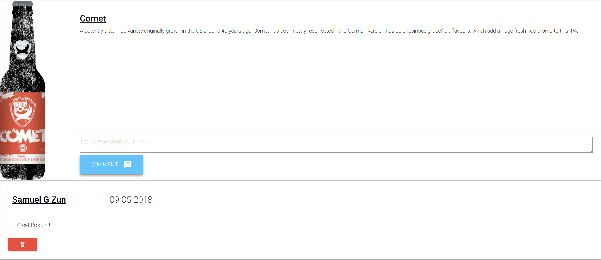

# Bottled

An e-commerce site which allows users to purchase different craft beverages to be shipped to their current location. This application uses solely ES6 on both the client and server-sides.

## [Deployed Here](https://frozen-harbor-94469.herokuapp.com/)





## Getting Started

### Prerequisites

Installing Create-React-App and the latest versions of NPM and Node.

```
$ npm i -g create-react-app@latest
$ npm i -g node@latest
$ npm i -g npm@latest
```

### Installing

After cloning the repo, cd into the directory and install the required npm packages:

```
npm i
```

## Deployment

```
heroku login
heroku create
git add -A
git commit -m "heroku deployment"
git push heroku master
```

## Built With

- [ReactJS](https://reactjs.org/) - The web framework used
- [React Router](https://www.npmjs.com/package/react-router-dom) - Router allowing for single page applications
- [Redux](https://redux.js.org/) - Used for state management
- [Redux Thunk](https://github.com/reduxjs/redux-thunk) - Used for asynchronous state management
- [Axios](https://www.npmjs.com/package/axios) - Used for HTTP Requestsdeployment
- [Redux Form](https://redux-form.com/7.4.2/) - Used for wizard form
- [Node.js](https://nodejs.org/en/) - Backend
- [Mongoose](https://mongoosejs.com/) - Database ODM
- [Express](https://expressjs.com/) - Node.js Framwork
- [Body-Parser](https://www.npmjs.com/package/body-parser) - Middleware
- [Passport](http://www.passportjs.org/) - Authentication/Authorization Middleware
- [Passport-JWT](https://github.com/themikenicholson/passport-jwt) - Authenticaiton through JSON web token
- [Bcrypt.js](https://www.npmjs.com/package/bcryptjs) - Password Hashing
- [Materialize CSS](https://materializecss.com/) - CSS Framework
- [Joi](https://www.npmjs.com/package/joi) - Validation
- [Joi-Password-Complexity](https://www.npmjs.com/package/joi-password-complexity) - Passwrod Validation

## Authors

- **Treshawn Duncan** - [Tduncan14](https://github.com/Tduncan14)
- **Ricky Rosales** - [erosales95](https://github.com/erosales95)
- **Krupa Gawade** - [krupagawade](https://github.com/krupagawade)
- **Mike Leftakes** - [mleftakes](https://github.com/mleftakes)
- **Sam G Zun** - [SZun](https://github.com/SZun)
