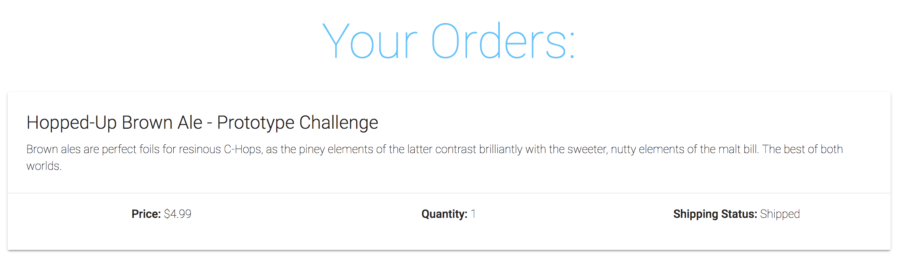
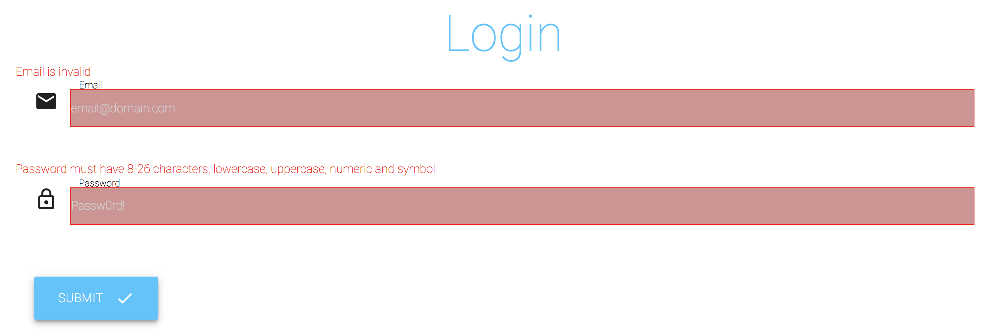
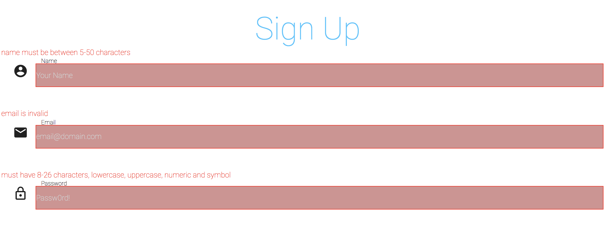

# Bottled

An e-commerce site which allows users to purchase different craft beverages to be shipped to their current location. This application was built using React,Redux,Node,Express & MongoDB as its fundemental building blocks, & uses solely ES6 on both the client and server-sides.

## [Deployed Here](https://quiet-forest-84841.herokuapp.com/)








## Getting Started

### Prerequisites

Installing the latest versions of Create-React-App, NPM, Node & Yarn.

```
$ npm i -g create-react-app@latest
$ npm i -g npm@latest
$ npm i -g node@latest
$ npm i -g yarn@latest
```

### Installing

After cloning the repo, cd into the directory and install the required npm & yarn packages:

```
$ npm i && cd client && yarn && cd ..
```

Then create a dev.js file in the config directory

```
$ cd config && touch dev.js && cd ..
```

Add in your passport secret and mongodb connection string

```
const keys = {
  secretOrKey: 'YOUR_SECRET_HERE',
  mongoURI: 'YOUR_CONNECTION_STRING_HERE'
};

export default keys;
```

##Scripts

In order of running the node server, react client, and developement (both server and client):

```
$ yarn server
$ yarn client
$ yarn dev
```

## Deployment

```
$ heroku login
$ heroku create
$ git add -A
$ git commit -m "heroku deployment"
$ git push heroku master
```

## Built With

- [ReactJS](https://reactjs.org/) - The web framework used
- [React Router](https://www.npmjs.com/package/react-router-dom) - Router allowing for single page applications
- [Redux](https://redux.js.org/) - Used for state management
- [Redux Thunk](https://github.com/reduxjs/redux-thunk) - Used for asynchronous state management
- [Axios](https://www.npmjs.com/package/axios) - Used for HTTP Requestsdeployment
- [Node.js](https://nodejs.org/en/) - Backend
- [Mongoose](https://mongoosejs.com/) - Database ODM
- [Express](https://expressjs.com/) - Node.js Framwork
- [Body-Parser](https://www.npmjs.com/package/body-parser) - Middleware
- [Passport](http://www.passportjs.org/) - Authentication/Authorization Middleware
- [Passport-JWT](https://github.com/themikenicholson/passport-jwt) - Authenticaiton through JSON web token
- [Bcrypt.js](https://www.npmjs.com/package/bcryptjs) - Password Hashing
- [Materialize CSS](https://materializecss.com/) - CSS Framework
- [Joi](https://www.npmjs.com/package/joi) - Validation
- [Joi-Password-Complexity](https://www.npmjs.com/package/joi-password-complexity) - Password Validation
- [Moment.js](https://momentjs.com/) - Date Parsing

## Authors

- **Treshawn Duncan** - [Tduncan14](https://github.com/Tduncan14)
- **Ricky Rosales** - [erosales95](https://github.com/erosales95)
- **Krupa Gawade** - [krupagawade](https://github.com/krupagawade)
- **Mike Leftakes** - [mleftakes](https://github.com/mleftakes)
- **Sam G Zun** - [SZun](https://github.com/SZun)
